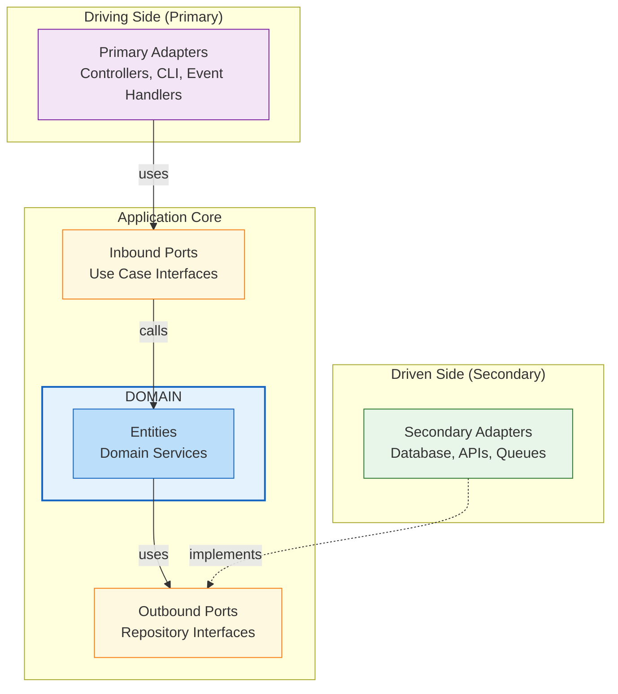
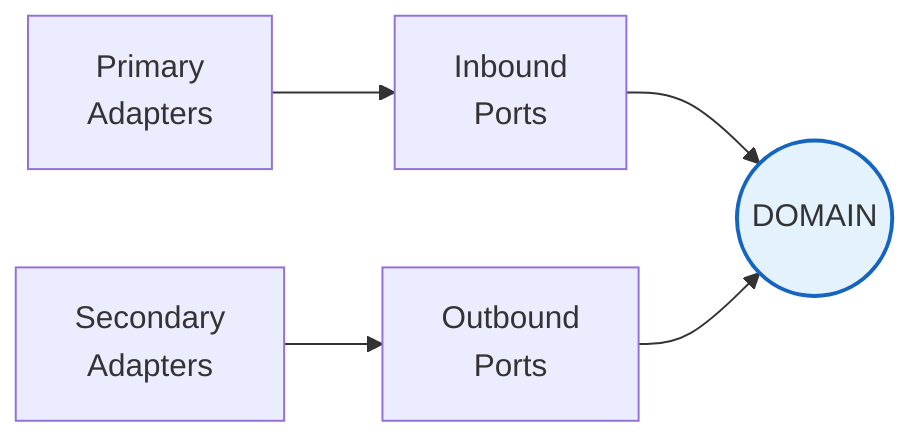

# Hexagonal Architecture Example

This example demonstrates how to use Pacta to enforce [Hexagonal Architecture](https://alistair.cockburn.us/hexagonal-architecture/) (also known as Ports and Adapters).

## Architecture Overview



## Directory Structure

```
src/
├── domain/                    # Core business logic (center of hexagon)
│   ├── product.py             # Domain entity
│   └── product_service.py     # Domain service
│
├── ports/
│   ├── inbound/               # Driving ports (use case interfaces)
│   │   └── catalog_use_case.py
│   └── outbound/              # Driven ports (repository interfaces)
│       └── product_repository.py
│
└── adapters/
    ├── primary/               # Driving adapters (controllers, CLI)
    │   └── api_controller.py
    └── secondary/             # Driven adapters (database, APIs)
        └── postgres_product_repository.py
```

## Key Rules

| Rule | Description |
|------|-------------|
| Domain → Adapters | **Forbidden** - Domain must not know about adapters |
| Domain → Outbound Ports | **Allowed** - Domain uses repository interfaces |
| Ports → Adapters | **Forbidden** - Ports are interfaces, adapters implement them |
| Primary Adapters → Domain | **Warning** - Should go through inbound ports |
| Secondary Adapters → Outbound Ports | **Allowed** - Implements the interface |
| Adapters → Adapters | **Forbidden** - Adapters should be independent |

## Usage

```bash
# Run architecture check
pacta scan . --model architecture.yml --rules rules.pacta.yml

# Expected output (clean architecture):
# ✓ 0 violations
```

## Dependency Flow

Dependencies always point **inward** toward the domain:



This ensures:
- Domain is isolated and testable
- Adapters can be swapped without changing business logic
- The application is framework-agnostic
