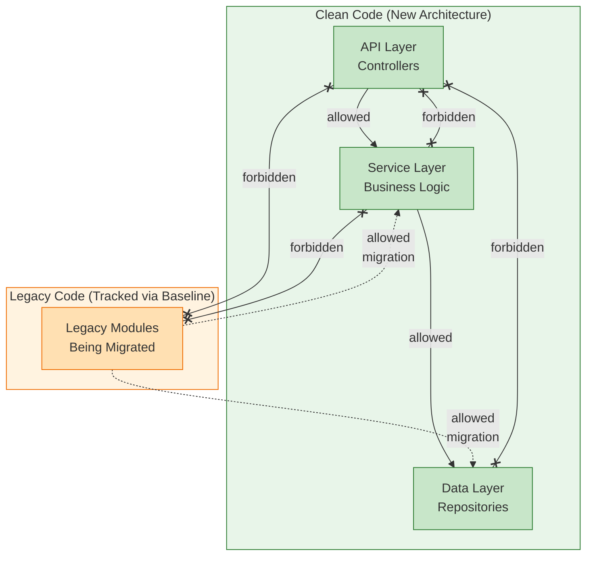

# Legacy Migration Example

This example demonstrates how to use Pacta's **baseline mode** to gradually migrate a brownfield codebase to clean architecture without blocking development.

## The Problem

You have a legacy codebase with architectural violations. You want to:

1. **Stop the bleeding** - Prevent new violations
2. **Track progress** - See violations decrease over time
3. **Not block development** - Existing violations shouldn't fail CI

## The Solution: Baseline Mode

Pacta's baseline mode lets you "snapshot" current violations and only fail on **new** violations.

## Architecture



## Directory Structure

```
src/
├── api/                # Clean code - new architecture
│   └── user_controller.py
├── services/           # Clean code - business logic
│   └── user_service.py
├── data/               # Clean code - repositories
│   └── user_repository.py
└── legacy/             # Legacy code - violations tracked via baseline
    └── old_user_handler.py
```

## Workflow

### Step 1: Run initial scan (see current violations)

```bash
pacta scan . --model architecture.yml --rules rules.pacta.yml
```

This shows all violations including legacy ones.

### Step 2: Create baseline

```bash
pacta scan . --model architecture.yml --rules rules.pacta.yml --save-ref baseline
```

This saves the current state. Future scans will compare against this.

### Step 3: Use baseline in CI

```bash
pacta scan . --model architecture.yml --rules rules.pacta.yml --baseline baseline
```

Now only **new** violations will fail the build.

### Step 4: Track progress over time

```bash
# View history
pacta history show . --last 10

# View violation trends
pacta history trends . --metric violations
```

## Example Output

**Without baseline** (all violations):
```
✗ 5 violations (3 error, 2 warning)
```

**With baseline** (only new violations):
```
✗ 5 violations (3 error, 2 warning) [1 new, 4 existing]

  ✗ ERROR [no_new_to_legacy] New code must not depend on Legacy
    status: new        ← This is NEW, will fail CI

  ✗ ERROR [no_service_to_api] Services must not depend on API
    status: existing   ← This is EXISTING, won't fail CI
```

## Migration Strategy

1. **Week 1**: Create baseline with current violations
2. **Ongoing**: All new code must follow rules (CI enforces)
3. **Sprint work**: Gradually fix legacy violations
4. **Track**: Use `pacta history trends` to show progress

## Key Rules

| Rule | New Code | Legacy Code |
|------|----------|-------------|
| Services → API | ❌ Forbidden | 📊 Tracked via baseline |
| Data → API | ❌ Forbidden | 📊 Tracked via baseline |
| Data → Services | ❌ Forbidden | 📊 Tracked via baseline |
| New → Legacy | ❌ Forbidden | N/A |
| Legacy → New | ✅ Allowed | ✅ Allowed (migration) |

## Tips

1. **Start strict**: Define rules for your target architecture, not current state
2. **Baseline early**: Create baseline before enforcing in CI
3. **Small fixes**: Fix 1-2 violations per sprint
4. **Celebrate progress**: Use trends to show improvement over time
5. **Prevent new debt**: CI should always fail on new violations
