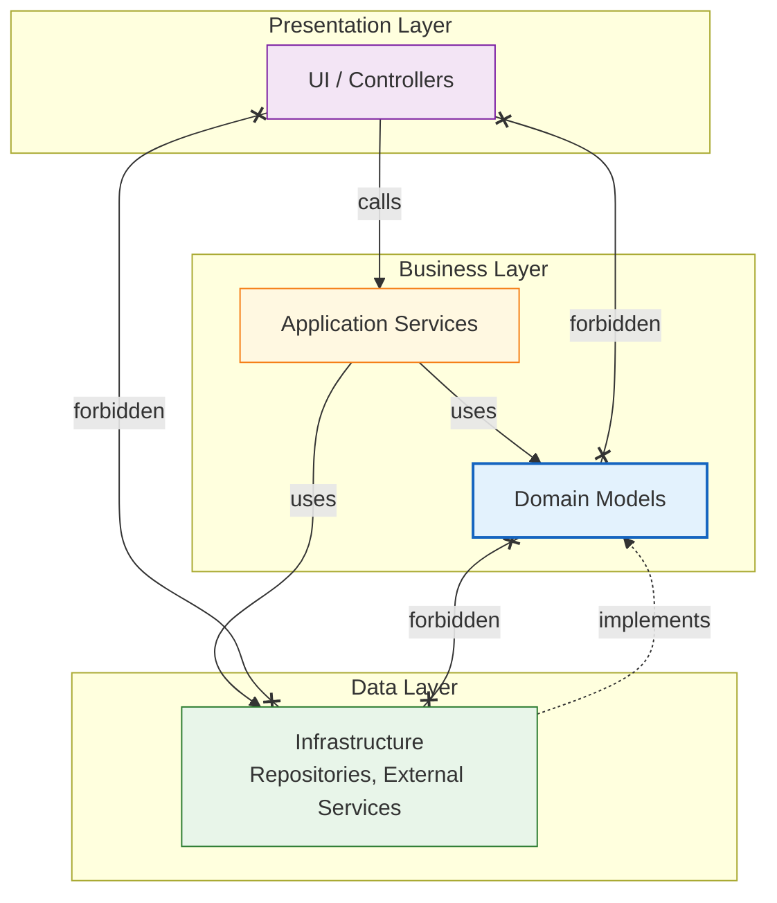

# Simple Layered App

A classic N-tier layered architecture with four layers demonstrating clean architecture principles.

## Architecture



## Directory Structure

```
src/
├── ui/           # Controllers, API endpoints
├── application/  # Use cases, services
├── domain/       # Business logic, models
└── infra/        # Repositories, database
```

## Layer Rules

| Rule | Description | Severity |
|------|-------------|----------|
| Domain → Infrastructure | Forbidden | Error |
| Domain → Application | Forbidden | Error |
| Domain → UI | Forbidden | Error |
| UI → Infrastructure | Forbidden | Warning |
| Infrastructure → Domain | Allowed (implements interfaces) | Info |
| Application → Domain + Infrastructure | Allowed | Info |

## Usage

```bash
cd examples/simple-layered-app

# Run architecture check
pacta scan . --model architecture.yml --rules rules.pacta.yml

# Save baseline
pacta scan . --model architecture.yml --rules rules.pacta.yml --save-ref baseline

# Compare against baseline
pacta scan . --model architecture.yml --rules rules.pacta.yml --baseline baseline
```

## Key Principles

1. **Dependency Inversion**: Domain doesn't depend on infrastructure details
2. **Separation of Concerns**: Each layer has a single responsibility
3. **Testability**: Domain can be tested without infrastructure
4. **Flexibility**: Infrastructure can be swapped without changing domain
